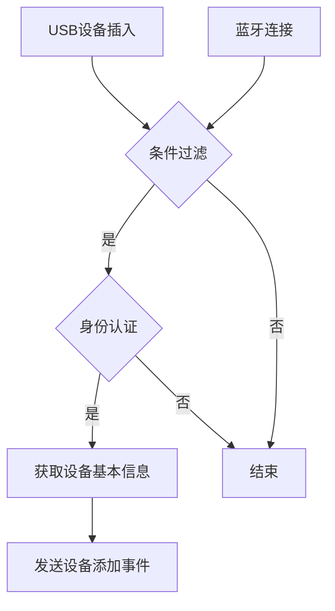

# Peripheral Manager

`Peripheral Manager` 是一个lib包，做外围设备管理的，可以连接所有的外围设备（暂定USB、BLE），目前本lib包只支持windows。包括设备连接管理、设备识别过滤、基础通信等。

本项目目的是降低软件与硬件通信的难度，集成多种通信方式，使能够更快捷更方便开发上层应用。

## 项目架构



## 外设通信方式

### USB

usb采用HID通信，固件中需要加入厂商自定义HID。最大长度64，不设置report id。

### BEL

采用GATT通信，service：0xFF00,characteristic：0xFF01。

基本通信方式，write后等待notify响应。

## Example

```rust
#[tokio::main]
async fn main() -> Result<(), Box<dyn std::error::Error>> {
    use peripheral_manager::{
        core::{AppOptions,App},
        api::{CoreEvent,PeripheralApi},
    };

    let options = AppOptions::new().set_broadcast(true, 10).
    set_usb_filter(Box::new(|x| x.vendor_id == 0x3373 && x.input_report_byte_length == 65));

    let app = App::start(Some(options)).await.unwrap();

    let all_devices = app.peripherals().await.unwrap();
    println!("all device len:{}",all_devices.len());

    let mut channel = app.register_broadcast().unwrap();
    
    loop {
        match channel.recv().await {
            Ok(v) => {
                match v {
                    CoreEvent::DeviceAdd(id) => {
                        println!("add device:{}",id.id());

                        let device = app.peripheral(&id.id()).await.unwrap();
                        
                        println!("device path :{:?}",device.address());
                        let mut buffer = [0; 51];
                        println!("read len:{:?}",device.read(&mut buffer).await?);
                        println!("read data {:?}",buffer);

                        let write_buf = [2;2];
                        let write_len = device.write(&write_buf).await?;
                        println!("write_len:{}",write_len);
                    },
                    CoreEvent::DeviceRemove(id) => {
                        println!("Remove:{:?}",id);
                    },
                }
            },
            Err(e) => println!("error: {:?}",e),
        }
    }
}
```


## Installation

### Cargo

Add the following line into your `Cargo.toml` file to make `peripheral_manager` a `[dependency]`
of your crate:

```
peripheral_manager = "<VERSION>"
```

#### Features

None


